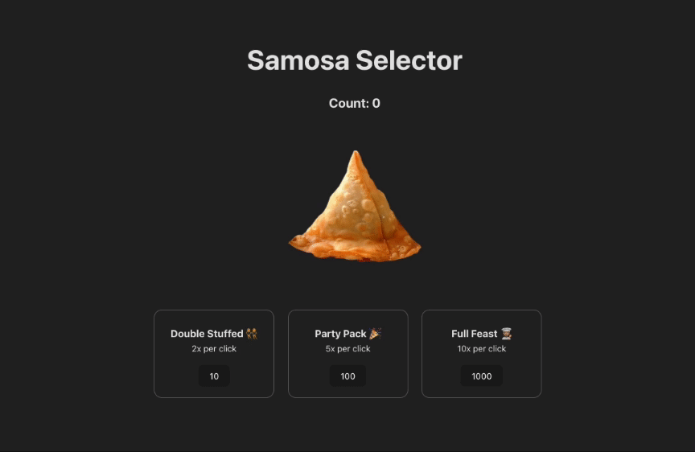

# Samosa Selector
Samosa Selector is based on an incremental game called Cookie Clicker.
The goal of the game is to produce as many Samosas by clicking on the Big Samosa as you can. 

## Gameplay
The game starts out with the user having zero samosas. When the user clicks the Big Samosa, it initially produces one samosa per click. Then,

When the user has 10 samosas, they can buy a Double Stuffed upgrade, which produces double the amount of samosas per click.
When the user has 100 samosas, they can buy the Party Pack upgrade, which produces 5x the amount of samosas per click.
When the user has 1000 samosas, they can buy the Full Feast upgrade, which produces 10x the amount of samosas per click.
The game continues on forever and the user can continue to gain gigantic amounts of samosas.


## Features
[] A large samosa that the user can click to harvest one samosa at a time

[] A counter displaying the number of samosas the user currently has

[] Three upgrades that increase the effectiveness of the user’s cursor at certain point thresholds

[] When purchasing an upgrade, the user loses samosas from their total count

[] Decrease the scale of the large samosa when the user clicks the samosa to create a pulse effect



# Getting started
**Install dependencies**
```
npm install
```

**Run the application in developer mode**

```
npm run dev
```

**Open project in the browser**

In the command line Vite will display a link, such as http://127.0.0.1:5173 to click on or copy/paste that will take you to the localhost port where the project is running.


**Tip:** If you'd like to stop the server, you can use ctrl + c or cmd + c within the Terminal, or use the trash can icon in the top right of the Terminal within VS Code. To run the server again, simply use npm run dev again.
